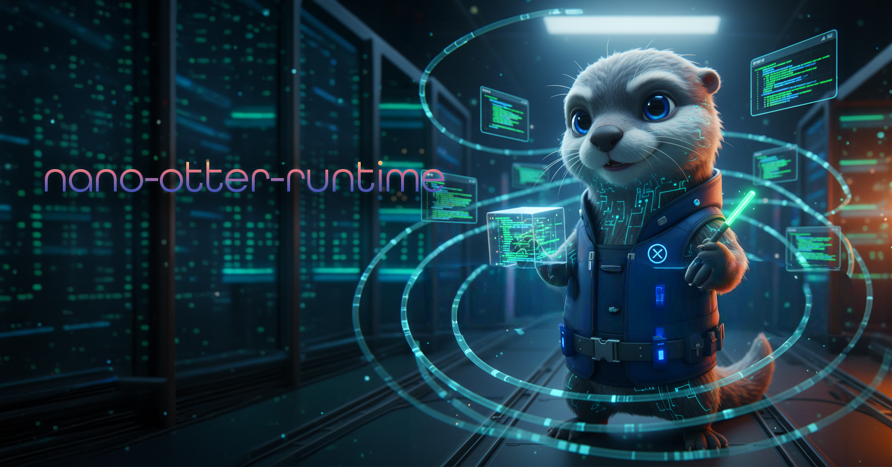
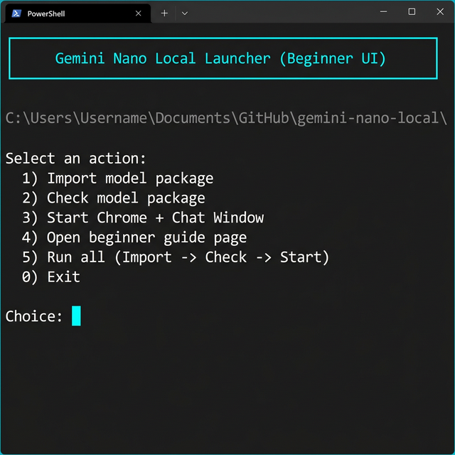
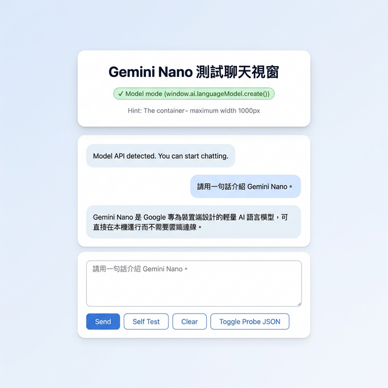

<p align="center">
  
</p>

# Gemini Nano Local Starter

> **[繁體中文版](README.zh-TW.md)**

A reproducible, verifiable starter template for running Chrome's built-in **Gemini Nano** (OptGuide On-Device Model) locally — import the model, validate integrity, and chat with it through a browser interface.

## Background

Security researchers publicly disclosed that Google Chrome (PC) silently downloads approximately **4 GB** of AI model data (`weights.bin`) without notifying users, stored at:

```text
%LOCALAPPDATA%\Google\Chrome\User Data\OptGuideOnDeviceModel\
```

Analysis confirmed this file is **Gemini Nano** — Chrome's on-device inference model powering the built-in Prompt API. The file is read-only and re-downloads automatically even after manual deletion.

> **This project's purpose**: Since the model is already on your drive, use it intentionally — launch it in a controlled environment, verify its integrity, and interact with it directly.

## Screenshots

<p align="center">
  &nbsp;
  
</p>
<p align="center"><sub>Left: Interactive terminal menu &nbsp;|&nbsp; Right: Chat test interface</sub></p>

## Features

- Import local model package (`weights.bin` + metadata)
- Verify model integrity via SHA256
- Launch an isolated Chrome Profile (no impact on daily browsing data)
- Auto-open chat test page with Echo fallback
- Interactive menu for first-time setup

## Quick Start

1. Run `start.cmd` from the project root.
2. Select `5` (Import → Check → Start), or run steps `1`, `2`, `3` individually.
3. Open the URL shown in the terminal: `http://localhost:<port>/chat-window.html`

## Model Files

> ⚠️ **Do not commit model files to Git.** `weights.bin` must remain local only.

The project's `.gitignore` excludes:

- `model/**` — only `model/.gitkeep` and `model/README.md` are tracked

### Locating the Model (Local Chrome)

```text
%LOCALAPPDATA%\Google\Chrome\User Data\OptGuideOnDeviceModel\<version>\
```

`<version>` is a date-stamped folder (e.g., `2025.8.8.1141`). Multiple versions may exist.

### Required Files

Place files under `model/<version>/`:

- `model/<version>/weights.bin`
- `model/<version>/manifest.json`
- `model/<version>/on_device_model_execution_config.pb`
- `model/<version>/_metadata/verified_contents.json`

### Import (Recommended)

```powershell
powershell -ExecutionPolicy Bypass -File .\scripts\Import-OptGuideModel.ps1
```

Or specify a custom source path:

```powershell
powershell -ExecutionPolicy Bypass -File .\scripts\Import-OptGuideModel.ps1 -SourceVersionDir "C:\Path\To\OptGuideOnDeviceModel\<version>"
```

### Pre-Commit Safety Check

```powershell
git status --short
git check-ignore -v model\<version>\weights.bin
```

If `git status` shows `model/<version>/weights.bin`, stop and review your `.gitignore`.

## Runtime Modes

| Mode         | Description                                                    |
| ------------ | -------------------------------------------------------------- |
| `Model mode` | Gemini Nano API detected — responses come from the local model |
| `Echo mode`  | No model API detected — input/output pipeline tested via echo  |

If stuck in `Echo mode`:

1. Re-run `start.cmd` to restart Chrome via the project script.
2. Confirm the URL is `http://localhost:<port>/chat-window.html` (not `file://`).
3. Open `probe/prompt-api-probe.html` to diagnose the API path.

## Key Files

| File                                 | Description                   |
| ------------------------------------ | ----------------------------- |
| `start.cmd`                          | Windows one-click entry point |
| `Start-QuickStart.ps1`               | Menu launcher entry           |
| `scripts/QuickStart-UI.ps1`          | Interactive menu flow         |
| `scripts/Import-OptGuideModel.ps1`   | Import model package          |
| `scripts/Check-ModelPack.ps1`        | Verify model integrity        |
| `scripts/Start-GeminiNanoChrome.ps1` | Launch Chrome + test page     |
| `probe/chat-window.html`             | Chat test page                |
| `probe/prompt-api-probe.html`        | Prompt API diagnostic page    |
| `guide/index.html`                   | Visual setup guide            |

## Manual Commands

```powershell
powershell -ExecutionPolicy Bypass -File .\scripts\Import-OptGuideModel.ps1
powershell -ExecutionPolicy Bypass -File .\scripts\Check-ModelPack.ps1
powershell -ExecutionPolicy Bypass -File .\scripts\Start-GeminiNanoChrome.ps1
```

## 🤖 AI-Assisted Development

This project was developed with AI assistance.

**AI Models/Services Used:**

- Gemini 2.5 Pro (Google Antigravity)

> ⚠️ **Disclaimer:** While the author has made every effort to review and validate the AI-generated code, no guarantee can be made regarding its correctness, security, or fitness for any particular purpose. Use at your own risk.

## License

[MIT License](https://opensource.org/licenses/MIT)
